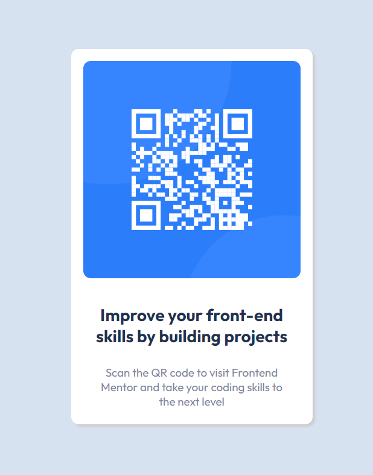

# Frontend Mentor - QR code component solution

This is a solution to the [QR code component challenge on Frontend Mentor](https://www.frontendmentor.io/challenges/qr-code-component-iux_sIO_H).

## Table of contents

- [Overview](#overview)
  - [Screenshot](#screenshot)
  - [Links](#links)
- [My process](#my-process)
  - [Built with](#built-with)
  - [Useful resources](#useful-resources)
- [Author](#author)

## Overview

### Screenshot

### Links

- Solution URL: [get code 🌐](https://github.com/VishalMauryastp/qr-code-component-main/)
- Live Site URL: [preview 🌐](https://vishalmauryastp.github.io/qr-code-component-main/)

## My process

### Built with

- Semantic HTML5 markup
- CSS custom properties
- Flexbox
- Mobile-first workflow

### Useful resources

- [Figma](https://www.figma.com) - This helped me for measure the width & height. I really helpful to make the designs .

## Author

- Frontend Mentor - [@Vishal Maurya](https://www.frontendmentor.io/profile/VishalMauryastp)
- LinkedIn - [@in-vishalmaurya](https://www.linkedin.com/in/in-vishalmaurya/)